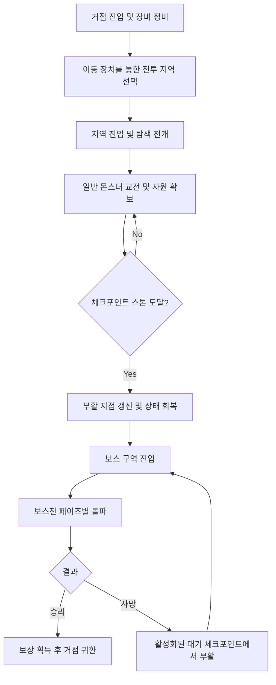

# ProjectR 코어 디자인

생성자: YUCHAN BAE
카테고리: 기획
생성 일시: 2026년 4월 9일 오후 2:56

> 본 문서는 프로젝트의 이정표 역할을 하는 하이레벨 기획서이다. 구체적인 수치 체계 및 상세 로직은 별도 문서에서 다루며, 본 문서는 프로젝트의 핵심 흐름과 뼈대를 직관적으로 파악하기 위해 작성되었다.
> 

---

## 1. 핵심 기획 방향성

### 1.1 핵심 컨셉

- **포스트 아포칼립스 사냥:** 절망적 세계관 속에서 다양한 몬스터 및 거대 보스를 사냥한다.
- **TPS + 소울라이크:** 잔탄/반동 제어 및 타이밍 회피(무적 프레임)가 결합된 하드코어 전투를 경험한다.
- **무기 중심의 전투 시스템:** 복잡한 캐릭터 직업(클래스) 구분을 두지 않는다. 플레이어가 장비하는 주무기가 해당 유저의 공격 방식과 전술적 역할을 사실상 결정한다.

### 1.2 멀티 플레이 지원

- **싱글 플레이 기반, 멀티 플레이 선택적 지원:** 1인 플레이 기준으로 게임의 모든 튜토리얼 및 보스 구간을 클리어할 수 있도록 기획한다. 협동(멀티 플레이)은 필수가 아닌 선택 사항이며, 파티 구성 시 전투 생존력과 교전 효율이 상승하는 상호 보완적 구조를 취한다.
- **독립 파훼 가능한 기믹 구성:** 보스와 일반 적의 공격 패턴은 단일 플레이어가 특정 무기에 구애받거나 다른 유저의 개입 없이도 기본적인 조작(이동, 회피, 사격)만으로 파훼가 가능하도록 짠다. 협동을 강제하는 스위치 동시 조작 등의 기믹은 배제한다.

---

## 2. 코어 게임플레이 루프

### 2.1 코어 루프

게임의 전반적인 진행은 안전한 거점에서 출발해 전투 지역으로 진입한 뒤, 목표를 달성하고 보상을 얻어 다시 복귀하는 순환 구조로 이루어진다.

1. **거점 진입 및 구역 선택:** 몬스터가 등장하지 않는 거점(베이스캠프)의 중심 이동 장치와 상호작용하여 진입할 전투 지역을 선택한다.
    
    ![[2-2] 램넌트의 거점 포탈](ProjectR%20%EC%BD%94%EC%96%B4%20%EB%94%94%EC%9E%90%EC%9D%B8/image.png)
    
    [2-2] 램넌트의 거점 포탈
    
    ![[2-3] 램넌트의 전투 지역 선택 화면](ProjectR%20%EC%BD%94%EC%96%B4%20%EB%94%94%EC%9E%90%EC%9D%B8/image%201.png)
    
    [2-3] 램넌트의 전투 지역 선택 화면
    
2. **탐험 및 전투:** 진입한 전투 구역에서 일반 몬스터를 처치하며 나아간다. 진행 과정에서 탄약과 체력 회복 아이템을 전리품으로 획득하여 자원을 잃지 않도록 관리한다.
3. **체크포인트 도달:** 보스 전용 구역에 진입하기 전, 마지막 체크포인트를 활성화한다. 사망 시 무작위 장소가 아닌 이 지점에서 부활하게 된다.
    
    ![[2-4] 체크 포인트 오브젝트](ProjectR%20%EC%BD%94%EC%96%B4%20%EB%94%94%EC%9E%90%EC%9D%B8/image%202.png)
    
    [2-4] 체크 포인트 오브젝트
    
4. **보스 조우 및 결산:** 해당 구역의 최종 보스를 처치하여 주요 보상을 획득한 후, 거점으로 귀환하여 다음 지역 진입을 준비한다.

### 2.2 전투 액션

전투는 한정된 자원에 의존하는 '회피'와 직관적인 '사격'의 균형으로 구성된다.

- **사격과 회피의 분배:** 적의 공격 징후를 확인하여 사격으로 피해량을 누적할지, 무적 판정이 있는 '구르기'를 통해 생존할지 판단한다. 구르기는 스태미너라는 한정형 자원을 소모하므로 적의 엇박자 공격이나 난전에 대비해 소모 빈도를 관리해야 한다.
    
    ![[2-5] 램넌트 구르기 장면, HUD 하단 스태미너 바를 통해 잔여 스태미너 시각화](ProjectR%20%EC%BD%94%EC%96%B4%20%EB%94%94%EC%9E%90%EC%9D%B8/image%203.png)
    
    [2-5] 램넌트 구르기 장면, HUD 하단 스태미너 바를 통해 잔여 스태미너 시각화
    
- **모드(Mod) 게이지 시스템:** 적에게 가한 피해량에 비례하여 주무기에 부착된 특수기(Mod) 게이지가 충전된다. 게이지가 가득 차면 고유 스킬을 발동할 수 있으며, 이 발동 타이밍이 위기 극복의 핵심이 된다.

### 2.3 사망 및 소생

파티의 구성 인원수에 따라 사망 판정 방식과 소생 여부가 규칙적으로 변경된다.

- **싱글 플레이:** 플레이어의 체력이 0이 되면 유예 없이 즉시 사망 처리되며, 마지막으로 저장된 체크포인트에서 부활한다.
- **멀티 플레이:** 플레이어의 체력이 0이 될 경우 '다운' 상태로 전환하여 제자리에서 일정 시간 대기한다. 이 시간 동안 생존한 다른 유저가 다가와 상호작용을 유지하면 체력을 일정량 회복한 상태로 소생된다. 단, 소생을 시도하는 도중 적의 공격에 피격당하면 진행 바가 즉시 초기화되며, 대기 시간이 모두 초과되면 완전 사망 처리된다.
    
    ![[2-6] 램넌트 동료 소생 장면](ProjectR%20%EC%BD%94%EC%96%B4%20%EB%94%94%EC%9E%90%EC%9D%B8/image%204.png)
    
    [2-6] 램넌트 동료 소생 장면
    

---

## 3. 다양한 무기 타입

모든 무기로 게임 내 모든 타겟을 제압할 수 있는 범용성을 보장하되, 출몰하는 적의 스폰 형태와 보스의 패턴 전개 방식에 따라 상성상 효율이 급상승하는 구간을 설계한다.

### 3.1 무기별 기획 의도

- **돌격소총:** 연사 속도가 빠르고 반동 제어가 용이한 표준형 무기. 단일 표적을 상대로 이동 간에도 끊임없이 데미지를 누적시킬 수 있어 범용적인 교전에 가장 적합하다. 그로기 게이지에 미치는 영향력은 단발당 낮지만, 지속 사격으로 시간을 들이면 누적형으로 그로기를 유발할 수 있다.
- **유탄발사기:** 기본 발사는 직사 형태로 표적에 직접 명중시키는 폭발 무기. 솔로 플레이에서도 단독 교전이 어렵지 않도록 직사 명중 즉시 폭발하는 직관적인 사격감을 가진다. 특수 스킬(모드) 발동 시에는 곡사 형태로 전환되어, 명중 시 여러 개의 작은 투사체로 분리되며 지면을 따라 도탄(Bounce)한다. 도탄된 투사체는 지면에 닿는 순간 광역 폭발하거나 일정 시간 지속되는 장판을 형성한다.
- **볼트액션 소총:** 장전 속도와 연사력이 매우 낮지만, 적의 약점 부위에 타격했을 때 데미지 증가 배율이 압도적이다. 몬스터가 치명적인 공격을 캐스팅할 때 그 과정을 강제로 캔슬시키고 그로기를 유발하는 등 순간 억지력에 특화된 무기다. 그로기 게이지에 미치는 영향력은 모든 무기 중 가장 높으며, 특히 약점 적중 시 단 한 발로 그로기를 유발할 수 있을 정도의 효율을 가진다.

### 3.2 그로기 게이지 시스템

몬스터는 체력바와 별개로 그로기 게이지를 가진다. 이 시스템은 적의 자원 축을 두 개로 분리하여, **무기 선택의 의미를 단순한 데미지 효율 이상으로 확장**한다.

**동작 원칙**

- 보스는 100의 그로기 게이지를 가진 채로 전투를 시작한다.
- 피격당할 때마다 무기별로 정해진 그로기 데미지가 누적되어 게이지가 감소한다.
- 게이지가 0에 도달하면 일정 시간 그로기 상태에 진입한다. 이 동안 모든 행동(공격, 이동, 캐스팅)이 정지되며, 받는 데미지가 일정 비율 증가한다.
- 그로기 종료 후 게이지는 100으로 회복되며, 보스는 정상 행동을 재개한다.

**무기별 그로기 효율**

무기마다 그로기 게이지에 가하는 수치를 다르게 밸런싱하여, 일반 데미지 축과는 별도의 무기 정체성을 형성한다.

| 무기 | 그로기 효율 | 운용 의미 |
| --- | --- | --- |
| 돌격소총 | 낮음 (지속 누적형) | 시간을 들이면 누적 사격으로 그로기 유발 가능 |
| 유탄발사기 | 중간 (광역 압박형) | 단발 폭발로 중간 수준의 게이지 압박 |
| 볼트액션 | 높음 (단발 강타형) | 약점 적중 시 한 발로 그로기 유발 가능 |

---

## 4. 레벨 및 보스 기획

### 4.1 보스 디자인 원칙

본 프로젝트의 보스전은 다음 두 가지 원칙을 충족하도록 설계한다. 구체적인 패턴과 페이즈 구성은 본 원칙을 만족하는 한 자유롭게 변경될 수 있다.

- **무기별 활약 구간:** 보스전은 최소 3개의 단계로 나뉘며, 각 단계는 특정 주무기(돌격소총, 유탄발사기, 볼트액션)가 가장 효과적으로 작동하는 구간을 가진다. 어떤 무기를 골라도 활약할 순간이 반드시 존재한다.
- **솔로 호환성:** 모든 패턴은 단일 플레이어가 무기 종류와 무관하게 기본 조작(이동, 회피, 사격)만으로 파훼할 수 있도록 한다. 협동을 강제하는 동시 조작 기믹은 도입하지 않는다.

### 4.2 보스 페이즈 구성 (예시안)

> ⚠️ **본 절의 페이즈 구성은 위 디자인 원칙을 충족하기 위한 하나의 예시안이며, 개발 진행 과정에서 변경될 수 있다.**
> 

| 단계 | HP 구간 | 보스 위협 양상 | 활약 무기 |
| --- | --- | --- | --- |
| Phase A | 100~75% | 근접 돌진과 광역 휩쓸기 위주의 물리 타격 | 돌격소총 (이동 사격으로 거리 유지 및 어그로 분담) |
| Phase B | 75~33% | 다수의 부유형 투사체를 공중에 소환하여 자동 추적 발사 | 유탄발사기 (광역 폭발로 투사체 일괄 정리) |
| Phase C | 33% 이하 | 광역 전멸기 캐스팅 시 약점 부위 노출 | 볼트액션 (정밀 저격으로 캐스팅 강제 차단) |

각 페이즈의 위협 양상과 활약 무기의 대응 관계가 핵심이며, 구체적인 모션 횟수, 데미지, 쿨타임 등의 수치는 별도 기획 필요.

---

## 5. 레벨 공간 구성

탐색 피로도를 낮추고 전투 교전의 몰입도를 유지하기 위해, 공간 탐색 자체의 복잡함보다는 사격 감각의 환기와 진행감 부여가 중심이 되는 직관적인 동선을 구성한다.

**구역 공간의 분리:** 안전 거점에서 포탈을 통해 진입하는 형태를 유지한다. 레벨 내부는 사격 감각과 회피 타이밍을 환기시키는 '연습용 표적 구역(파괴 가능 환경 오브젝트)', 탄약과 핵심 교전 자원을 획득할 수 있는 '탐색 구역', 그리고 메인 보스방 진입 직전의 휴식을 위한 '체크포인트 구역'으로 명확한 기승전결 템포를 나눈다.

---