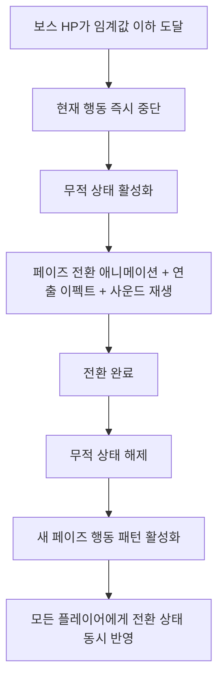

# [시스템 기획] AI_보스

생성자: YUCHAN BAE  
카테고리: 기획  
생성 일시: 2026년 4월 16일  

> **작성 목적:** 보스 AI의 페이즈 구성, 전환 처리, 전멸기, 약점 노출, 멀티플레이 어그로 처리를 명세한다.

---

## 목차

1. [보스 AI 구성](#1-보스-ai-구성)
2. [페이즈 구성](#2-페이즈-구성)
3. [페이즈 전환 처리](#3-페이즈-전환-처리)
4. [전멸기(Wipe Mechanic)](#4-전멸기wipe-mechanic)
5. [약점 부위 노출](#5-약점-부위-노출)
6. [멀티플레이 어그로 처리](#6-멀티플레이-어그로-처리)

---

## 1. 보스 AI 구성

보스는 **페이즈 상태 머신(Phase State Machine)** + **패턴 행동 트리(Pattern Behavior Tree)**로 구성된다.

- **페이즈 상태 머신**: HP 임계값 기반으로 Phase A / B / C 전이 관리
- **패턴 행동 트리**: 현재 페이즈 내 패턴 선택, 쿨타임 관리, 캐스팅 처리

---

## 2. 페이즈 구성

| 페이즈 | HP 임계값 | 행동 특성 | 활약 무기 |
| --- | --- | --- | --- |
| Phase A | 100% ~ 75% | 이동 및 근접 중심 패턴 | 돌격소총 |
| Phase B | 75% ~ 33% | 광역 투사체 및 중거리 압박 | 유탄발사기 |
| Phase C | 33% ~ 0% | 전멸기 캐스팅 + 약점 노출 | 볼트액션 |

> 위 페이즈 구성은 예시안이며, 구체 패턴 및 수치는 보스 패턴 명세서에서 별도 정의.

---

## 3. 페이즈 전환 처리

### 3.1 전환 흐름

### 3.2 전환 처리 규칙

- 페이즈 전환 트리거는 서버에서 HP 임계값 감지 후 발동
- 전환 연출 중 보스는 피해를 받지 않음 (무적 구간)
- 전환 완료 이전까지 새 페이즈 행동 패턴이 시작되지 않음
- 전환 연출 및 새 페이즈 시작은 모든 플레이어 화면에 동시에 반영

---

## 4. 전멸기(Wipe Mechanic)

| 항목 | 값 |
| --- | --- |
| 캐스팅 시간 | 8 초 |
| 캐스팅 취소 조건 | 그로기 상태 진입 |
| 발동 시 효과 | 아레나 내 모든 플레이어 즉시 사망 처리 |

- 캐스팅 시작 시 보스 머리 위 캐스팅 바 UI 표시
- 캐스팅 중 그로기 게이지 0 도달 시 캐스팅 즉시 취소 및 그로기 상태 진입
- Phase C에서 캐스팅 취소 시 약점 부위 판정 영역이 그로기 지속 시간 동안 활성화

---

## 5. 약점 부위 노출

### 5.1 노출 조건 및 타이밍

- 약점 부위 피격 판정은 기본적으로 **비활성화** 상태
- 지정 조건(전멸기 캐스팅 취소 등) 충족 시 활성화 + 시각적 연출(발광 이펙트) 재생

### 5.2 비활성화 조건

- 그로기 지속 시간 종료 시 즉시 비활성화
- 비활성화 시 약점 부위 피해 배율 적용 중단

### 5.3 약점 피해 배율

- 약점 부위 활성화 중 적중 시 별도 고배율 피해 적용 (보스 전용 데이터 테이블에서 정의)

---

## 6. 멀티플레이 어그로 처리

### 6.1 보스 어그로 원칙

- 보스는 일반 AI와 동일한 위협도 기반 타겟 선택 규칙을 기본 적용
- **복수 타겟 공격 패턴**: 일부 보스 패턴은 현재 타겟 외 다른 플레이어를 동시 공격
  - 복수 타겟 패턴은 보스 패턴 명세서에서 별도 정의
  - 광역 투사체, 전멸기 등은 아레나 내 전원 대상

### 6.2 어그로 재평가 주기

- 기본 3초마다 위협도 재평가
- 패턴 실행 중에는 타겟 전환 보류 (패턴 완료 후 재평가)

### 6.3 타겟 전환 제한

- **어그로 락(Aggro Lock):** 타겟 전환을 수행한 뒤 최소 5초간 타겟 고정 (위협도 역전 무시)
- 보스 특정 패턴 실행 중 타겟 전환 강제 금지 (패턴 중단 파훼 방지)
- 현재 타겟 사망 또는 다운 시 어그로 락과 상관없이 즉시 다음 위협도 보유 플레이어로 우선 전환

---

*본 문서의 수치는 초기 기획값이며, 보스 패턴 명세서에서 구체 수치가 확정된다.*
