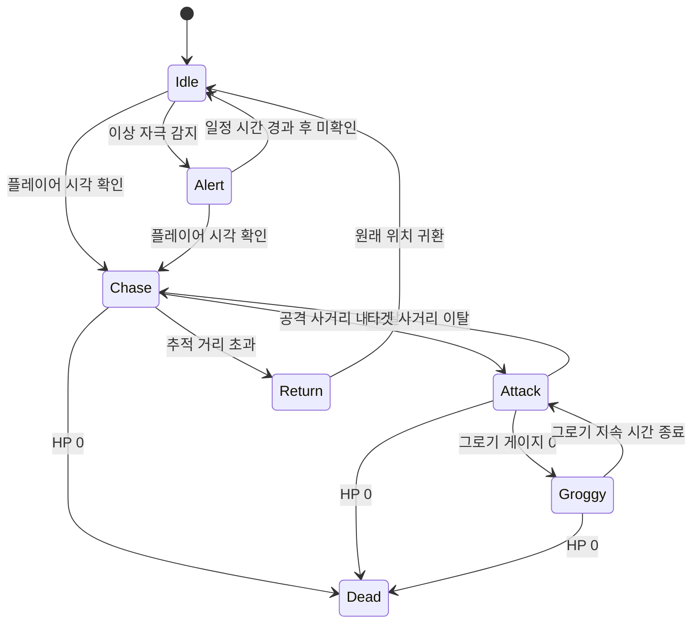

# [시스템 기획] AI_일반몬스터

생성자: YUCHAN BAE  
카테고리: 기획  
생성 일시: 2026년 4월 16일  

> **작성 목적:** 일반 몬스터의 AI 행동 패턴, 상태 전이, 감지, 공격, 어그로, 스폰, 그로기 처리를 명세한다.

---

## 목차

1. [AI 구성 방식](#1-ai-구성-방식)
2. [상태 정의](#2-상태-정의)
3. [감지 시스템](#3-감지-시스템)
4. [공격 패턴](#4-공격-패턴)
5. [사망 처리](#5-사망-처리)
6. [어그로 및 타겟팅 시스템](#6-어그로-및-타겟팅-시스템)
7. [스폰 시스템](#7-스폰-시스템)
8. [그로기 처리 (AI 측)](#8-그로기-처리-ai-측)

---

## 1. AI 구성 방식

일반 몬스터 AI는 상태 머신(State Machine)과 행동 트리(Behavior Tree)를 결합하여 동작한다.

- **상태 머신**: 최상위 상태(Idle / Alert / Chase / Attack / Return / Dead) 전이 관리
- **행동 트리**: 각 상태 내 구체적 행동 결정 (타겟 선택, 공격 패턴 선택, 경로 탐색 등)

---

## 2. 상태 정의

| 상태 | 설명 | 진입 조건 | 탈출 조건 |
| --- | --- | --- | --- |
| Idle | 대기 / 순찰 | 초기 상태, 플레이어 미감지 | 플레이어 감지 |
| Alert | 이상 감지 | 청각 자극 또는 시야 경계 내 이동체 감지 | 시각 확인 또는 일정 시간 후 Idle 복귀 |
| Chase | 추적 | 플레이어 시각 확인 | 공격 범위 진입 또는 추적 포기 |
| Attack | 공격 | 공격 사거리 내 진입 | 공격 패턴 완료 또는 타겟 사거리 이탈 |
| Return | 복귀 | 추적 거리 초과 또는 추적 포기 | 원래 위치 귀환 완료 |
| Groggy | 그로기 | 그로기 게이지 0 도달 | 그로기 지속 시간 종료 |
| Dead | 사망 | HP 0 도달 | 없음 |

### 상태 전이 다이어그램

---

## 3. 감지 시스템

| 항목 | 값 |
| --- | --- |
| 시야 거리 | 1500 cm |
| 시야각 | 120 도 (좌우 각 60도) |
| 청각 반응 거리 | 500 cm (발소리, 사격음 기준) |
| 시야 갱신 주기 | 0.2 초 |

- 장애물에 의한 시야 차단: 시선(Line of Sight) 체크 적용
- 청각 자극은 시야 외 영역에서도 Alert 상태 진입 유발

---

## 4. 공격 패턴

| 패턴 | 사거리 | 쿨타임 | 설명 |
| --- | --- | --- | --- |
| 근접 타격 | 200 cm 이내 | 1.5 초 | 전방 휩쓸기. 피격 판정 활성화 기반 |
| 원거리 투사체 | 200 ~ 1500 cm | 3.0 초 | 투사체 발사. 플레이어 방향 예측 조준 |

- 공격 패턴 선택: 현재 타겟과의 거리 기반으로 자동 선택
- 패턴 발동 전 선행 동작(예고 모션) 0.5 초 재생

### 4.1 원거리 투사체 조준 모드 분류

원거리 공격 시 상황에 따라 두 가지 조준 모드로 분기된다.

| 모드 | 설명 | 적용 조건 |
| --- | --- | --- |
| Lead Target (예측 조준) | 플레이어의 현재 이동 방향과 속도를 예측하여 앞 지점을 조준 | 플레이어가 이동 중일 때 |
| Present (현위치 조준) | 플레이어의 현재 위치를 직접 조준 | 플레이어가 정지 중일 때 |

---

## 5. 사망 처리

1. HP 0 도달 시 Dead 상태 진입
2. 사망 애니메이션 재생
3. 피격 판정 비활성화
4. AI 행동 중단
5. 드롭 테이블 참조하여 아이템 드롭 처리
6. 일정 시간(5 초) 후 메시 페이드아웃 및 제거

---

## 6. 어그로 및 타겟팅 시스템

### 6.1 위협도(Threat) 기반 타겟 선택

적은 파티원 각각에게 쌓인 위협도(Threat 수치)를 기반으로 현재 타겟을 결정한다.

| 행동 | 위협도 증가량 |
| --- | --- |
| 피해 가함 (피해량 1당) | +1 |
| 소생 시도 | +50 |
| 적 근접 (200 cm 이내) | +0.5 / 초 |

### 6.2 어그로 재평가 주기

- 어그로 재평가는 **기본 3초마다** 실행
- 재평가 시 위협도 순위에 따라 타겟 전환 여부 판단

### 6.3 타겟 전환 조건

- **어그로 락(Aggro Lock):** 타겟 전환 후 최소 5초간은 다른 유저의 위협도가 역전하더라도 이전 타겟을 락(Lock)하여 공격 애니메이션 도중 핑퐁되는 현상 방지
- 어그로 락 해제 후 다른 플레이어의 위협도가 현재 타겟 위협도보다 **1.3배 이상** 높아질 경우 타겟 전환
- 단, 현재 타겟이 사망 또는 다운 상태 진입 시 어그로 락과 무관하게 즉시 다음 높은 위협도 보유 플레이어로 전환

### 6.4 멀티플레이 복수 타겟 처리

- 일반 몬스터는 단일 타겟만 추적
- 파티원이 복수일 경우 각자 독립적으로 위협도 계산 후 타겟 선택

---

## 7. 스폰 시스템

### 7.1 스폰 포인트

- 레벨에 배치된 스폰 포인트를 통해 스폰 위치 정의
- 스폰 포인트는 플레이어 시야 외 위치(카메라 가시 범위 외부)에서만 활성화

### 7.2 스폰 조건

| 조건 유형 | 설명 |
| --- | --- |
| 구역 진입 | 플레이어가 트리거 영역에 진입 시 스폰 시작 |
| 이벤트 트리거 | 특정 오브젝트 상호작용 또는 조건 충족 시 스폰 |
| 보스 아레나 진입 | 아레나 진입 트리거 활성화 시 보스 스폰 |

### 7.3 웨이브 관리

| 항목 | 설명 |
| --- | --- |
| 웨이브 수 | 레벨 데이터에서 정의 (1 ~ N 웨이브) |
| 웨이브 전환 조건 | 현재 웨이브 적 전멸 또는 시간 경과 |
| 웨이브 딜레이 | 기본 3 초 |
| 동시 최대 스폰 수 | 레벨별 정의 (기본 8 마리) |

### 7.4 멀티플레이 스케일링

파티 인원 수에 따라 적 스탯과 스폰 수량을 조정한다.

| 인원 수 | 적 체력 배율 | 적 공격력 배율 | 추가 스폰 수 |
| --- | --- | --- | --- |
| 1인 | 1.0x | 1.0x | 기본 |
| 2인 | 1.4x | 1.1x | +1 마리 / 웨이브 |
| 3인 | 1.8x | 1.2x | +2 마리 / 웨이브 |

- 스케일링은 세션 시작 시 파티 인원 수 기준으로 서버에서 계산

---

## 8. 그로기 처리 (AI 측)

### 8.1 그로기 진입

- 그로기 게이지 0 도달 시 현재 진행 중인 공격 패턴 즉시 중단
- 그로기 진입 애니메이션 재생
- 모든 이동 및 공격 행동 중단
- 피해 배율 증가 상태 플래그 활성화 (1.5x)

### 8.2 그로기 지속

- 그로기 지속 시간 타이머 기산 (기본 5 초)
- 지속 중 추가 피해 수신 가능 (배율 적용)
- 지속 중 추가 그로기 게이지 피해는 누적되지 않음 (게이지 0 고정)

### 8.3 그로기 종료

1. 타이머 만료
2. 그로기 종료 애니메이션 재생
3. 그로기 게이지 최대치(100%)로 리셋
4. 피해 배율 증가 플래그 비활성화
5. 정상 행동 재개

---

*본 문서의 수치는 초기 기획값이며, 보스 패턴 명세 및 밸런스 조정에 따라 변경될 수 있다.*
