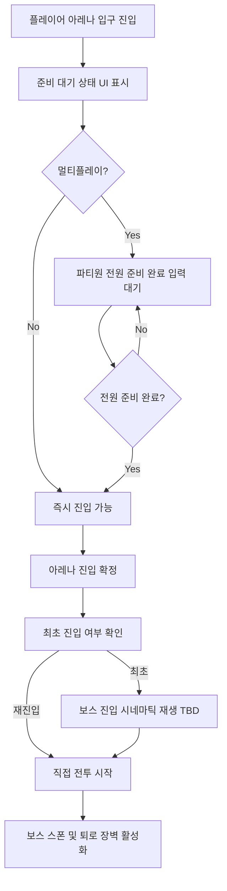

# [시스템 기획] 레벨_보스아레나

생성자: YUCHAN BAE  
카테고리: 기획  
생성 일시: 2026년 4월 16일  

> **작성 목적:** 보스 아레나 진입·퇴장 처리와 보스 처치 후 흐름을 명세한다.

---

## 목차

1. [보스 아레나 시스템](#1-보스-아레나-시스템)

---

## 1. 보스 아레나 시스템

### 1.1 아레나 진입 흐름

### 1.2 아레나 진입 규칙

- **싱글**: 진입 즉시 확정
- **멀티**: 아레나 입구에 준비 상호작용 존재. 파티원 전원이 준비 입력 시 동시 진입
- 미준비 파티원이 강제 진입 시: TBD (현재 방침 미정)

### 1.3 퇴로 차단

- 아레나 진입 확정 시 입구 장벽 활성화
- 장벽은 플레이어 및 적 모두 통과 불가

### 1.4 보스 처치 후 처리

1. 보스 사망 처리
2. 보스 사망 연출 (애니메이션, 이펙트, 사운드)
3. 입구 장벽 비활성화
4. 보상 아이템 월드 스폰
5. 거점 귀환 포탈 활성화 (TBD)
6. 자동 저장 트리거

---

*본 문서의 미정(TBD) 항목은 개발 진행에 따라 확정된다.*
