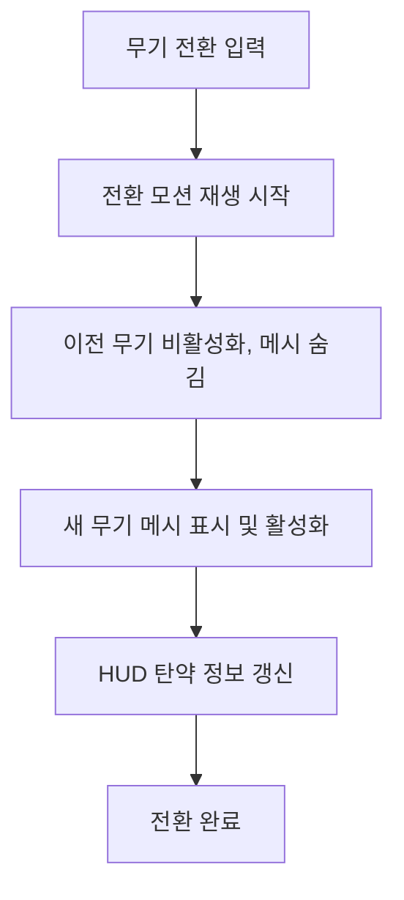

# [시스템 기획] 무기_장비

생성자: YUCHAN BAE  
카테고리: 기획  
생성 일시: 2026년 4월 16일  

> **작성 목적:** 무기 장착, 데이터 관리, 탄약, 반동, Mod 장착 시스템의 동작 방식 및 데이터 구조를 구체적으로 명세한다.

---

## 목차

1. [무기 장착 및 교체](#1-무기-장착-및-교체)
2. [무기 데이터 관리](#2-무기-데이터-관리)
3. [탄약 시스템](#3-탄약-시스템)
4. [반동 시스템](#4-반동-시스템)
5. [무기 Mod 장착 시스템](#5-무기-mod-장착-시스템)

---

## 1. 무기 장착 및 교체

### 1.1 무기 슬롯 구성

| 슬롯 | 설명 |
| --- | --- |
| 주무기 슬롯 | 돌격소총, 유탄발사기, 볼트액션 중 1종 장착 |
| 보조무기 슬롯 | 권총 (TBD) |

- 초기 시작 시 기본 주무기 1종 장착 상태로 게임 시작
- 주무기는 월드 픽업 또는 거점 상점을 통해 변경

### 1.2 무기 전환

- 무기 전환 입력(마우스 휠 또는 X) 시 장착 모션 재생
- 전환 딜레이: 0.4 초
- 전환 모션 중 사격, 재장전, 다른 전환 입력 차단
- 전환 완료 시 새 무기의 현재 탄창 잔탄으로 HUD 갱신

### 1.3 무기 장착/해제 흐름

---

## 2. 무기 데이터 관리

### 2.1 무기 데이터 테이블 구조

모든 무기 스탯은 데이터 테이블로 관리하며 엑셀 연동을 통해 갱신한다.

| 항목 | 설명 |
| --- | --- |
| 무기 식별자 | 무기 고유 ID |
| 무기 타입 | 돌격소총 / 유탄발사기 / 볼트액션 |
| 기본 피해량 | 발당 기본 데미지 |
| 그로기 데미지 | 발당 그로기 게이지 피해량 |
| 발사 속도 | 초당 발사 횟수 |
| 탄창 용량 | 한 탄창의 최대 탄수 |
| 재장전 시간 | 전체 재장전 소요 시간 (초) |
| ADS FOV | ADS 시 적용 시야각(FOV) |
| 발사 방식 | 풀오토 / 단발 / 볼트액션 |
| 탄약 타입 | 소총탄 / 유탄 / 볼트탄 |
| 발사 방식 (투사체 여부) | 히트스캔 또는 투사체 |
| Mod 슬롯 수 | 기본 1 |

### 2.2 무기 타입별 기본 스탯 (기획 초안)

| 항목 | 돌격소총 | 유탄발사기 | 볼트액션 |
| --- | --- | --- | --- |
| 기본 피해 | 18 | 75 (직격) | 120 |
| 약점 보너스 비율 | +0.5x | +0x | +1.1x |
| 그로기 데미지 | 5 | 20 | 50 |
| 탄창 | 30 발 | 6 발 | 5 발 |
| 연사력 | 600 RPM | - | - |
| 재장전 시간 | 2.0 초 | 3.0 초 | 2.5 초 |
| 발사 방식 | 히트스캔 | 투사체 | 히트스캔 |
| 유효 사거리 | 1500 cm | 해당 없음 | 5000 cm |
| 최대 사거리 | 5000 cm | 해당 없음 | 제한 없음 |
| Damage Falloff | 유효 사거리 초과 시 선형 감쇠 (최대 40% 감소) | 해당 없음 (폭발 반경 감쇠는 전투_사격_판정 기획서 참조) | 감쇠 없음 |

**Damage Falloff 상세:**
- **돌격소총**: 유효 사거리 1500cm까지 피해량 100% 적용. 1500cm 초과 ~ 5000cm 구간에서 선형 감쇠. 5000cm 지점에서 최대 40% 피해 감소.
- **볼트액션**: 사거리 제한 없음, 어떤 거리에서도 피해 감쇠 없음.
- **유탄발사기**: 투사체 이동 방식으로 사거리 개념 미적용. 폭발 반경 내 피해 감쇠는 전투_사격_판정 기획서 참조.

---

## 3. 탄약 시스템

### 3.1 탄약 타입 분류

| 탄약 타입 | 사용 무기 |
| --- | --- |
| 소총탄 | 돌격소총 |
| 볼트탄 | 볼트액션 |
| 유탄 | 유탄발사기 |

### 3.2 탄약 데이터 구성

| 항목 | 설명 |
| --- | --- |
| 현재 탄창 잔탄 | 현재 장전된 탄수 |
| 보유 탄약 | 탄창 외 소지 중인 총 탄약 수 |
| 최대 보유량 | 타입별 최대 소지 가능 탄약 수 |

| 탄약 타입 | 최대 보유량 |
| --- | --- |
| 소총탄 | 180 발 |
| 볼트탄 | 40 발 |
| 유탄 | 24 발 |

### 3.3 재장전 처리

1. 재장전 입력 수신
2. 현재 탄창 잔탄이 최대가 아니거나 남은 탄창 용량이 있을 경우 재장전 시작
3. 재장전 모션 재생 (재장전 시간 동안 사격 차단)
   - 볼트액션의 경우 탄창이 가득 차지 않았을 시 1회 추가 실행
4. 재장전 완료 시 보충량 = min(탄창 용량 - 잔탄, 보유 탄약)
   - 볼트액션의 경우 한 발씩 재장전
5. 보유 탄약에서 보충량 차감
6. 현재 탄창 잔탄 = 잔탄 + 보충량

### 3.4 탄약 픽업

- 월드에 배치된 탄약 픽업 오브젝트 상호작용(E키) 시 보유 탄약 증가
- 증가량은 픽업 오브젝트 데이터 테이블에서 정의
- 최대 보유량 초과 시 초과분 무시
- 이미 최대 보유량 보유 시 획득 불가 및 HUD에 '획득할 수 없습니다' 출력

---

## 4. 반동 시스템

### 4.1 반동 구성 요소

| 요소 | 설명 |
| --- | --- |
| 수직 반동 | 카메라 상방향 이동 |
| 수평 반동 (TBD) | 카메라 좌우 진동 |
| 크로스헤어 확산 | 조준점 확산 반경 증가 |

### 4.2 돌격소총 반동 패턴

연사 시 반동이 누적되는 패턴 기반 설계.

| 연사 발수 구간 | 수직 반동 (총합) | 수평 반동 방향 |
| --- | --- | --- |
| 1 ~ 5 발 | 약 (발당 0.3도) | 무작위 좌우 |
| 6 ~ 15 발 | 중 (발당 0.5도) | 우측 편향 |
| 16 발 이후 | 강 (발당 0.8도) | 좌우 진폭 확대 |

### 4.3 볼트액션 반동

- 단발 발사 시 강한 수직 반동 (1.5도) 후 복귀
- 볼트 모션(재코킹) 중 크로스헤어 확산 유지, 모션 완료 후 회복 시작

### 4.4 유탄발사기 반동

- 발사 시 경미한 수직 반동 (0.8도) + 카메라 셰이크 강조

### 4.5 크로스헤어 회복

- 발사 입력 중단 후 크로스헤어 확산이 기본 크기로 회복
- 회복 속도: 초당 확산 반경의 50% 감소 (선형 보간)
- ADS 중 회복 속도: 1.5배 적용

---

## 5. 무기 Mod 장착 시스템

### 5.1 Mod 슬롯 구성

- 무기마다 최대 1개 Mod 슬롯 제공
- Mod 미장착 상태에서는 Mod 게이지 및 발동 기능 비활성화

### 5.2 Mod 장착 처리

1. 인벤토리에서 Mod 아이템 선택
2. 장착 대상 무기 선택
3. 기존 장착 Mod가 있을 경우 자동 분리 후 인벤토리 반환
4. 새 Mod 장착 완료 및 효과 적용

### 5.3 Mod 데이터 테이블 구조

| 항목 | 설명 |
| --- | --- |
| Mod 식별자 | Mod 고유 ID |
| 표시 이름 | 인게임 표시 이름 |
| 효과 설명 | 발동 시 효과 설명 텍스트 |
| 발동에 필요한 게이지 최대치 | Mod 발동 조건 |
| 충전 배율 | 기본 1.0, Mod에 따라 조정 |
| 장착 가능한 무기 타입 | 호환 무기 목록 |

### 5.4 무기별 Mod 예시 (기획안)

| 무기 | Mod 이름 | 효과 |
| --- | --- | --- |
| 돌격소총 | 과열 탄환 | 발동 시 일정 시간 동안 발사 탄환에 화상 도트 피해 부여 |
| 유탄발사기 | 나팔탄 | 발동 시 다음 발사 유탄이 지면 충돌 후 장판 생성 |
| 볼트액션 | 공명 사격 | 발동 시 다음 1발이 관통 + 그로기 게이지 50% 직접 차감 |

> 위 예시는 방향성 제시용이며, 확정된 Mod 목록이 아니다.

---

*본 문서의 수치는 초기 기획값이며, 플레이 테스트를 통해 조정될 수 있다.*
