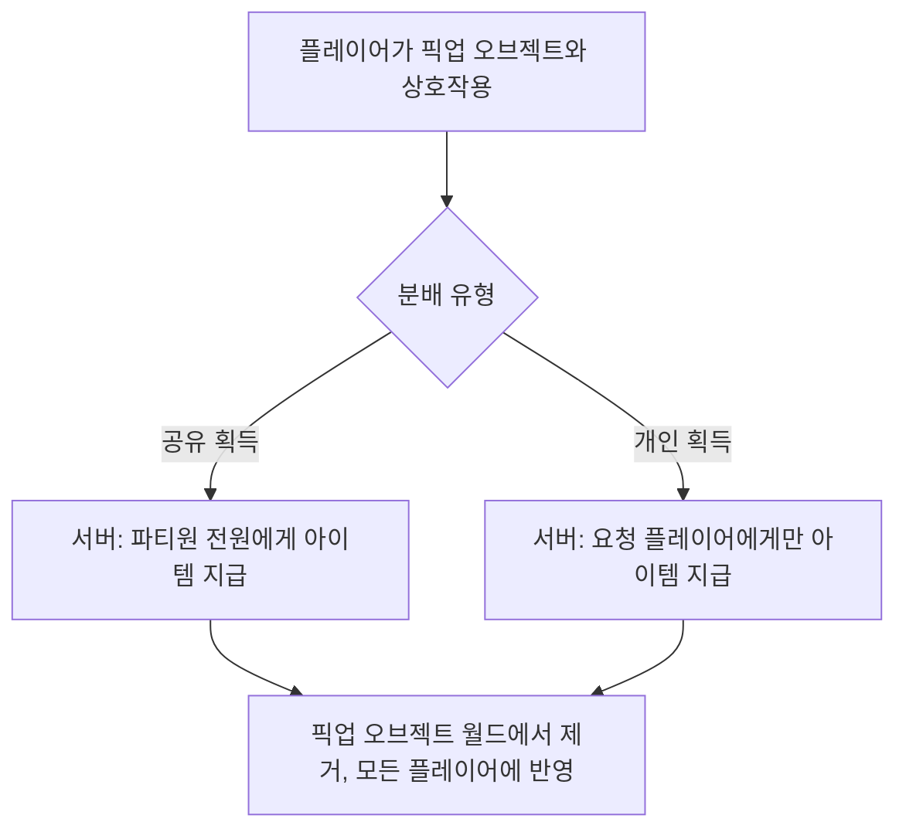

# [시스템 기획] 아이템_인벤토리

생성자: YUCHAN BAE  
카테고리: 기획  
생성 일시: 2026년 4월 16일  

> **작성 목적:** 아이템 픽업, 인벤토리 관리, 소비 아이템, 드롭, 자원, 멀티플레이 분배 시스템의 동작 방식과 데이터 구조를 명세한다.

---

## 목차

1. [픽업(Pickup) 시스템](#1-픽업pickup-시스템)
2. [인벤토리 시스템](#2-인벤토리-시스템)
3. [소비 아이템 시스템](#3-소비-아이템-시스템)
4. [아이템 드롭 시스템](#4-아이템-드롭-시스템)
5. [자원 관리 시스템](#5-자원-관리-시스템)
6. [멀티플레이 보상 분배 시스템](#6-멀티플레이-보상-분배-시스템)

---

## 1. 픽업(Pickup) 시스템

### 1.1 픽업 방식

| 방식 | 적용 아이템 | 설명 |
| --- | --- | --- |
| 수동 픽업 | 무기, Mod, 소비 아이템, 핵심 재료, 탄약 | E키 상호작용으로 획득 |

- **탄약 포함 모든 아이템은 수동 픽업(E키)으로 획득** (자동 픽업 없음)

### 1.2 픽업 오브젝트 구조

월드에 스폰되는 픽업 오브젝트는 아래 데이터를 포함한다.

| 항목 | 설명 |
| --- | --- |
| 아이템 ID | 데이터 테이블 참조 키 |
| 획득 수량 | 픽업 시 지급 수량 |
| 월드 수명 | 오브젝트가 자동 제거되는 시간 (초). 0이면 무제한 |
| 분배 유형 | 공유 획득 또는 개인 획득 |

### 1.3 멀티플레이 픽업 처리 흐름

---

## 2. 인벤토리 시스템

### 2.1 인벤토리 슬롯 구성

인벤토리는 카테고리별로 분리하여 관리한다.

| 카테고리 | 설명 |
| --- | --- |
| 무기 | 획득한 무기 목록 (주무기 슬롯 외 보관분 포함) |
| Mod | 획득한 Mod 아이템 목록 |
| 소비 아이템 | 체력 회복 아이템 등 소비성 아이템 |
| 재료 | 강화 또는 거래용 재료 아이템 |

- 슬롯 제한: TBD (현재 무제한 방향)
- 중량 제한: TBD (현재 미적용)

### 2.2 아이템 데이터 테이블 구조

| 항목 | 설명 |
| --- | --- |
| 아이템 식별자 | 아이템 고유 ID |
| 표시 이름 | 인게임 표시 이름 |
| 아이템 카테고리 | 무기 / Mod / 소비 / 재료 |
| 효과 설명 | 아이템 효과 및 설명 |
| 최대 스택 수 | 소비 아이템의 경우 최대 중첩 수량 |
| 아이템 썸네일 | 인벤토리 표시 이미지 |
| 드롭 가중치 | 드롭 테이블 가중치 참조용 |

### 2.3 아이템 상세 정보 표시

인벤토리 UI에서 아이템 선택 시 우측 패널에 표시:

- 아이템 이름, 카테고리
- 아이템 썸네일 이미지
- 효과 설명 텍스트
- 장착 / 사용 / 분해 버튼 (해당 카테고리에 따라 버튼 구성 변화)

---

## 3. 소비 아이템 시스템

### 3.1 소비 아이템 종류

| 아이템 | 효과 | 회복량 | 수량 제한 |
| --- | --- | --- | --- |
| 심장(Heart) | 즉시 체력 회복 또는 팀원 소생 소모 | 최대 체력의 30% | 최대 5 개 소지 |
| 붕대(Bandage) | 일정 시간 동안 도트 회복 | 10 초에 걸쳐 최대 체력의 40% 회복 | 최대 10 개 소지 |

> 소비 아이템 종류 및 수치는 TBD. 위 목록은 초기 방향성 예시.

### 3.2 사용 처리

- 사용 입력 시 사용 모션 재생 여부: TBD
- 심장(즉시 회복): 입력 즉시 현재 체력에 직접 회복량 추가
- 붕대(도트 회복): 사용 후 10 초간 매 1 초마다 회복량 / 10 만큼 체력 증가
- 사용 중 피격 시 모션 취소 여부: TBD

### 3.3 쿨타임 및 제한

- 심장 연속 사용 쿨타임: 1.5 초
- 붕대 적용 중 새 붕대 사용: 기존 효과 갱신(타이머 리셋)

### 3.4 소생 비용

- 심장 1개를 소비하여 다운된 파티원 소생 시작 가능
- 소생 완료 시 다운된 플레이어의 심장 1개 소모
- 다운된 플레이어 보유 심장도 0이면 소생 불가

---

## 4. 아이템 드롭 시스템

### 4.1 드롭 테이블 구조

몬스터별 드롭 테이블은 데이터 테이블로 관리한다.

| 항목 | 설명 |
| --- | --- |
| 몬스터 식별자 | 몬스터 고유 ID |
| 드롭 항목 목록 | 드롭 가능한 아이템 항목들 |
| 드롭 아이템 ID | 해당 항목의 아이템 ID |
| 최소 드롭 수량 | 해당 항목 드롭 시 최소 수량 |
| 최대 드롭 수량 | 해당 항목 드롭 시 최대 수량 |
| 드롭 확률 | 0.0 ~ 1.0 범위 |

### 4.2 드롭 처리 흐름

1. 몬스터 사망 시 해당 몬스터의 드롭 테이블 참조
2. 각 드롭 항목에 대해 드롭 확률 판정
3. 성공한 항목은 최소~최대 수량 범위에서 무작위 수량 결정
4. 결정된 아이템과 수량으로 픽업 오브젝트 월드 스폰

### 4.3 보스 전용 드롭

- 보스 처치 시 전용 고정 드롭 항목 반드시 포함
- 고정 드롭 아이템: 보스 전용 무기 또는 Mod 1개 (드롭 확률 100%)
- 추가 랜덤 드롭: 보스 드롭 테이블에서 일반 항목 별도 판정

### 4.4 드롭 오브젝트 수명

- 월드 스폰 후 기본 수명: 120 초
- 수명 종료 시 자동 제거
- 보스 전용 드롭 오브젝트: 수명 무제한 (보스 아레나 내 유지)

---

## 5. 자원 관리 시스템

### 5.1 소모성 자원 종류

| 자원 | 설명 |
| --- | --- |
| 탄약 (타입별) | 무기 발사에 소모. 타입별 분리 관리 |
| 심장 | 체력 회복 및 소생에 사용 |
| 재화 | 거점 상점 및 강화에 사용 |

### 5.2 거점 귀환 시 자원 보충

- 거점 귀환 시 탄약 전 타입 최대 보유량으로 자동 보충
- 심장은 거점 귀환 시 기본 보유 수(3개) 이하라면 3개로 보충 (TBD)
- 재화는 귀환 시 변화 없음

---

## 6. 멀티플레이 보상 분배 시스템

### 6.1 분배 규칙 분류

| 유형 | 아이템 종류 | 획득 방식 |
| --- | --- | --- |
| 공유 획득 | 무기, Mod, 핵심 재료 | 한 명 픽업 시 파티원 전원 동시 획득 |
| 개인 획득 | 탄약, 소비 아이템 | 픽업한 플레이어만 획득 |

### 6.2 공유 획득 처리

1. 플레이어가 공유 아이템 픽업 상호작용
2. 서버에서 공유 아이템 확인
3. 파티원 전원의 인벤토리에 해당 아이템 추가
4. 픽업 오브젝트 월드에서 제거, 모든 플레이어에게 반영
5. 각 클라이언트에 획득 알림 UI 표시

### 6.3 개인 획득 처리

1. 플레이어가 개인 아이템 픽업 상호작용
2. 서버에서 개인 아이템 확인
3. 해당 플레이어의 자원에만 아이템 추가
4. 픽업 오브젝트 월드에서 제거, 모든 플레이어에게 반영

### 6.4 보스 처치 보상 분배

- 보스 처치 보상 아이템은 전원 공유 획득 규칙 적용
- 보스 아레나 내 드롭 오브젝트 스폰 후 각 파티원이 수동으로 픽업
- 같은 아이템을 여러 파티원이 픽업 시도 시 첫 번째 픽업자 기준으로 전원 지급 처리

---

*본 문서의 수치는 초기 기획값이며, 플레이 테스트를 통해 조정될 수 있다.*
