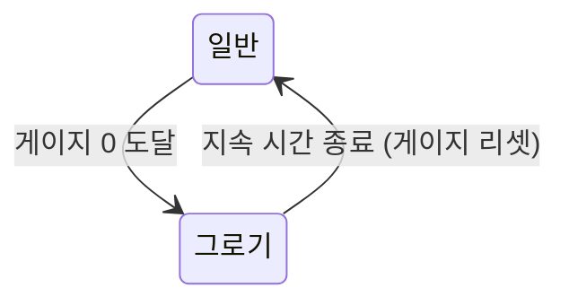

# [시스템 기획] 전투_게이지_상태

생성자: YUCHAN BAE  
카테고리: 기획  
생성 일시: 2026년 4월 16일  

> **작성 목적:** 그로기 게이지, Mod 게이지, 상태이상, 장판 시스템, 전투 피드백의 동작 방식을 명세한다.

---

## 목차

1. [그로기 게이지 시스템](#1-그로기-게이지-시스템)
2. [무기 Mod 게이지 시스템](#2-무기-mod-게이지-시스템)
3. [상태이상 시스템](#3-상태이상-시스템)
4. [장판(AoE Zone) 시스템](#4-장판aoe-zone-시스템)
5. [전투 피드백(Game Feel)](#5-전투-피드백game-feel)

---

## 1. 그로기 게이지 시스템

### 1.1 게이지 구조

그로기 게이지는 HP와 별개로 존재하는 독립 게이지이다. 적별로 최대치가 다르며, 0에 도달하면 그로기 상태에 진입한다.

| 항목 | 설명 |
| --- | --- |
| 최대치 | 적 데이터 테이블에서 개별 정의 |
| 현재치 | 무기 공격으로 감소 |
| 회복 | 그로기 종료 후 최대치로 즉시 리셋 |
| 자연 회복 | 없음 (전투 중 자연 감소 없음) |

### 1.2 무기별 그로기 데미지

| 무기 | 발당 그로기 데미지 | 특성 |
| --- | --- | --- |
| 돌격소총 | 5 | 지속 누적형. 연사로 꾸준히 누적 |
| 유탄발사기 | 20 (직격) / 10 (폭발 범위) | 광역 압박형. 넓은 범위에 중간 누적 |
| 볼트액션 | 50 | 단발 강타형. 약점 적중 시 그로기 게이지 급속 소진 가능 |

### 1.3 그로기 상태

| 항목 | 값 |
| --- | --- |
| 진입 조건 | 그로기 게이지 0 도달 |
| 지속 시간 | 5 초 (적 데이터 테이블에서 조정 가능) |
| 상태 중 행동 | 모든 행동(이동, 공격, 회피) 중단 |
| 피해 배율 | 기본 피해의 1.5배 수신 |
| 종료 후 | 행동 재개 및 게이지 100% 리셋 |

### 그로기 상태 흐름

---

## 2. 무기 Mod 게이지 시스템

### 2.1 게이지 충전

- 플레이어가 적에게 피해를 가할 때마다 Mod 게이지 충전
- 충전량은 가한 피해량 기반 (피해 1당 게이지 1 적립, 기본 비율)
- 최대 게이지 도달 시 발동 가능 상태로 전환 및 UI 알림

### 2.2 게이지 수치

| 항목 | 값 |
| --- | --- |
| 최대 Mod 게이지 | 100 |
| 충전 비율 | 피해량 1당 1 충전 (무기 및 Mod에 따라 조정) |
| 발동 조건 | 게이지 100 도달 |

### 2.3 Mod 발동

- Mod 전환 입력(기본: F)으로 토글, 모드 상태에서 사격 시 Mod 사용
- 발동 즉시 게이지 0으로 초기화
- 발동 중 중복 입력 무시

---

## 3. 상태이상 시스템

### 3.1 상태이상 분류

상태이상은 **임시 상태이상**과 **저주(Blight) 계열**로 구분된다.

| 분류 | 특성 |
| --- | --- |
| 임시 상태이상 | 일정 시간 후 자동 해제. 구르기 등 특정 행동으로 단축 가능 |
| 저주(Blight) | 시간 경과로 해제 불가. 특정 아이템 또는 오브젝트로만 해제 |

### 3.2 임시 상태이상 목록

| 상태이상 | 효과 | 기본 지속 시간 | 해제 조건 |
| --- | --- | --- | --- |
| 화상(Burn) | 지속 피해 (도트 데미지) | 5 초 | 자동 해제 또는 구르기 시 즉시 해제 |
| 출혈(Bleed) | 회복 아이템 효과 50% 반감 | 8 초 | 자동 해제 |
| 부식(Corrode) | 받는 피해 증가 (기본 +20%) | 6 초 | 자동 해제 |

### 3.3 저주(Blight) 계열

| 저주 유형 | 효과 | 해제 방법 |
| --- | --- | --- |
| 저주 기본형 | TBD | 특정 정화 아이템 사용 또는 거점 정화 오브젝트 상호작용 |

> 저주 세부 종류 및 수치는 밸런스 조정에 따라 확정.

### 3.4 중첩 규칙 및 상한선(Cap)

- **상태이상 중첩 상한선:** 네트워크 패킷 부하(Flooding) 방지를 위해 DoT(화상, 출혈 등) 상태이상은 **최대 3회(3스택)까지만 중첩 가능**
- **동일 속성 중첩 시**: 스택 1 추가 (최대 3스택). 이미 3스택 도달 상태라면 지속시간만 갱신
- **다른 속성 중첩 시**: 각 상태이상 독립 적용 (상태이상 종류별 최대 3회씩 허용)
- 상태이상 적용 시 해당 아이콘과 현재 중첩 스택(x1, x2, x3)을 HUD에 표시

### 3.5 상태이상 적용 주체

- 플레이어 → 적: 특정 무기 Mod 발동 시 적용
- 적 → 플레이어: 특정 적 공격 패턴에 의해 적용

---

## 4. 장판(AoE Zone) 시스템

### 4.1 장판 효과 정의

장판은 유탄발사기 Mod를 통해 생성된다. 생성 주체(플레이어/적)에 따라 아군, 적, 또는 모두에게 영향을 줄 수 있다.

| 항목 | 값 |
| --- | --- |
| 최대 동시 장판 수 | 5 개 (오브젝트 풀 기반 관리) |
| 생성 후 활성화 딜레이 | 0.3 초 |
| 기본 지속 시간 | 5 초 |

### 4.2 장판 적용 범위

| 장판 유형 | 적용 대상 |
| --- | --- |
| 적 저지 장판 | 적군만 피해 수신 |
| 지원 장판 (TBD) | 아군만 회복 효과 수신 |

### 4.3 장판 적용 방식

| 방식 | 설명 |
| --- | --- |
| 도트 피해(DoT) | 일정 주기(0.5 초)마다 피해 적용 |
| 1회 즉발 | 장판 진입 시 1회 피해 적용 |

- 도트 피해 1틱 기본 수치: 장판 생성 무기 기본 데미지의 20%
- 장판 범위 내 적 체류 시 그로기 게이지 도트 감소 적용 (틱당 그로기 데미지의 30%)

### 4.4 중첩 규칙

- 동일 유형의 장판이 같은 영역에 중첩될 경우: 지속시간만 갱신, 피해 중복 없음
- 서로 다른 유형의 장판: 독립 적용

---

## 5. 전투 피드백(Game Feel)

### 5.1 히트마커

- 적 적중 성공 시 크로스헤어 주변에 히트마커 아이콘 0.2 초 표시
- 색상 분류:

| 색상 | 의미 |
| --- | --- |
| 흰색 | 일반 적중 |
| 적색 (굵게) | 약점/치명 적중 |
| 회색 (둔탁) | 장갑/비유효 타격 |

### 5.2 히트스톱

- 적 적중 순간 게임 속도를 0.05 초간 0.1배로 감속 후 복귀
- 폭발 적중 시 히트스톱 배제 (광역 판정 특성상 불필요)

### 5.3 카메라 셰이크

| 이벤트 | 셰이크 강도 | 지속 시간 |
| --- | --- | --- |
| 사격 반동 (돌격소총) | 약(0.3) | 0.1 초 |
| 사격 반동 (볼트액션) | 중(0.6) | 0.2 초 |
| 폭발 (유탄발사기) | 강(1.0) | 0.3 초 |
| 플레이어 피격 | 중(0.5) | 0.2 초 |

### 5.4 피격 화면 효과

- 피격 시 화면 테두리 적색 효과 0.5 초 적용
- 체력 30% 이하 시 상시 약한 테두리 효과 + 심박 사운드 재생

### 5.5 처치 확인 피드백

- 적 사망 시 크로스헤어에 처치 확인 마커(X 모양) 0.5 초 표시

---

*본 문서의 수치는 초기 기획값이며, 플레이 테스트를 통해 조정될 수 있다.*
