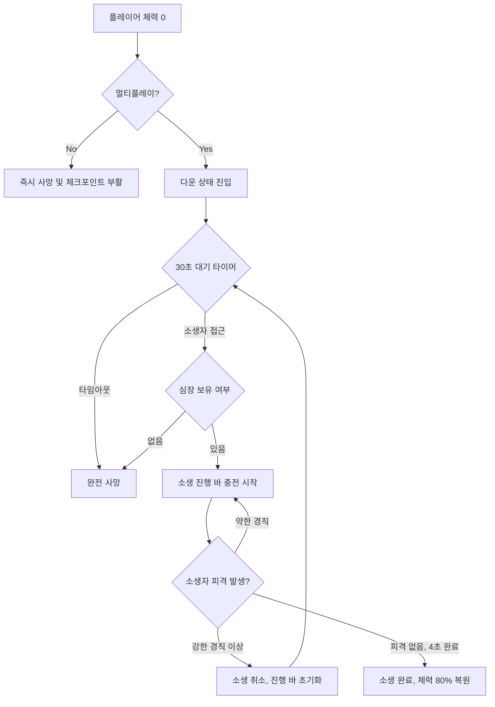

# [시스템 기획] 플레이어_이동_생존

생성자: YUCHAN BAE  
카테고리: 기획  
생성 일시: 2026년 4월 16일  

> **작성 목적:** 캐릭터 이동, 스태미너, 체력, 피격, 다운·소생·전멸 시스템의 동작 방식과 수치를 명세한다.

---

## 목차

1. [캐릭터 이동](#1-캐릭터-이동)
2. [스태미너 시스템](#2-스태미너-시스템)
3. [체력 시스템](#3-체력-시스템)
4. [피격 시스템](#4-피격-시스템)
5. [다운·소생·전멸 시스템](#5-다운소생전멸-시스템)

---

## 1. 캐릭터 이동

### 1.1 이동 방식

8방향 전방위 이동을 지원한다. 입력 축은 월드 기준이 아닌 카메라 전방 기준으로 변환하여 적용한다.

| 이동 상태 | 최대 속도 (기본값) | 조건 |
| --- | --- | --- |
| 걷기 | 350 cm/s | 기본 이동 입력 |
| 달리기 | 600 cm/s | 달리기 입력 유지 + 스태미너 잔량 존재 |
| ADS 이동 | 200 cm/s | ADS 상태 진입 시 이동 속도 오버라이드 |
| 다운 상태 | 50 cm/s | 기어가기 가능 |

- 달리기 중 ADS 입력 시 달리기 강제 해제, ADS 이동 속도로 즉시 전환
- 달리기 중 사격 입력 시 달리기 강제 해제 후 사격 처리

### 1.2 구르기

구르기는 방향 지정이 가능하며, 발동 즉시 무적 프레임(I-Frame) 구간에 진입한다.

| 항목 | 값 (기본값) |
| --- | --- |
| 이동 거리 | 350 cm |
| 전체 모션 시간 | 0.6 초 |
| 무적 프레임 구간 | 모션 시작 후 0.1 ~ 0.45 초 |
| 쿨타임 | 없음 (스태미너 소모로 제한) |
| 스태미너 소모 | 30 |

- 이동 입력이 없을 때 구르기 시 캐릭터 전방 방향으로 구름
- 무적 프레임 구간 중 수신된 피해는 완전 무효
- 구르기 모션 종료 전까지 이동, 구르기 재입력, 사격, 재장전, 상호작용 입력 차단

### 1.3 이동 중 사격

| 상태 | 사격 허용 여부 |
| --- | --- |
| 걷기 | 허용 |
| 달리기 | 불허 (달리기 강제 해제 후 사격) |
| 구르기 | 불허 |
| ADS 이동 | 허용 |

---

## 2. 스태미너 시스템

### 2.1 기본 수치

| 항목 | 값 (기본값) |
| --- | --- |
| 최대 스태미너 | 100 |
| 구르기 소모량 | 30 |
| 달리기 소모 속도 | 20 / 초 |
| 회복 딜레이 | 마지막 소모 후 1.5 초 |
| 회복 속도 | 40 / 초 |

### 2.2 소모 조건

- 전투 상태일 때 구르기 및 달리기 시 소모
- 스태미너가 0인 상태에서 구르기 및 달리기 입력은 무시

### 2.3 고갈 상태

- 스태미너 0 도달 시 달리기 및 구르기 불가 플래그 활성화
- 스태미너가 회복 후 최소 임계치(기본값 20) 이상 도달 시 플래그 해제
- 고갈 상태 중 일반 이동(걷기)은 허용

### 2.4 회복 규칙

- 달리기 입력 해제 또는 구르기 완료 후 딜레이 타이머 기산
- 딜레이 중 추가 소모 발생 시 타이머 리셋
- 딜레이 경과 후 매 프레임 회복 속도 적용

---

## 3. 체력 시스템

### 3.1 3중 레이어 체력 구조

체력은 시각적, 기능적으로 3개의 독립된 레이어로 구성된다.

| 레이어 | 명칭 | 설명 |
| --- | --- | --- |
| 1 | 현재 체력 바 | 실제 현재 체력. 피해 수신 시 즉시 감소 |
| 2 | 회복 가능 체력 바 | 회복 가능 게이지. 입은 피해의 50%에 해당하는 수치. 일정 시간 미피격 시 자동 도트 회복 |
| 3 | 지연 체력 바 | 지연 감소 바. 피해 수신 직후 시각적으로 느리게 감소하는 레이어 (게임 피드백용) |

### 3.2 기본 수치

| 항목 | 값 (기본값) |
| --- | --- |
| 최대 체력 | 100 |
| 회복 가능 체력 회복 딜레이 | 미피격 후 5 초 |
| 회복 가능 체력 회복 속도 | 5 / 초 |
| 지연 체력 바 감소 속도 | 피해 수신 후 1.5 초에 걸쳐 목표값 도달 |

### 3.3 피해 수신 처리

1. 피해량 계산 (무기 기반 데미지 × 부위 배율 × 상태 보정)
2. 현재 체력 바에서 피해량 차감
3. 회복 가능 체력 바에 (피해량 × 0.5) 적립
4. 지연 체력 바 목표값을 회복 가능 체력 바 값으로 갱신, 감소 시작
5. 미피격 타이머 리셋

### 3.4 체력 0 도달 시 분기

| 플레이 모드 | 처리 |
| --- | --- |
| 싱글 플레이 | 즉시 사망 처리. 마지막 활성 체크포인트에서 부활 |
| 멀티 플레이 | 다운(Down) 상태 진입. 소생 가능 대기 상태 |

### 3.5 회복 아이템 적용

- 소비 아이템 사용 시 종류에 따라 즉시 회복, 혹은 지속 회복. 현재 체력 바에 회복
- 용의 심장: 즉시 회복
- 블러드워트: 사용 시 30초에 걸쳐 초당 1.7의 체력을 회복하는 소모품
- 회복 가능 체력 바와 무관하게 직접 현재 체력을 증가

### 3.6 회복 스킬 적용

- 무기 모드를 통해 체력 회복

---

## 4. 피격 시스템

### 4.1 경직과 다운

플레이어 방어력 계산 후 들어오는 최종 데미지에 따라 모션이 결정된다.

| 분류 | 비고 | 피격 데미지 기준 |
| --- | --- | --- |
| 약한 경직 | 진행 중인 행동(장전, 힐 등)이 취소된다. | 0 ~ 15 |
| 강한 경직 | 공격 받은 방향에서 크게 밀려나고 1 ~ 2초간 제어권을 잃는다. | 16 ~ 30 |
| 다운 | 공격 받은 방향에서 넘어지고 2 ~ 3초간 제어권을 잃는다. | 31 이상 |

---

## 5. 다운·소생·전멸 시스템

멀티플레이 전용 시스템이다. 싱글 플레이에서는 체력 0 시 즉시 사망 처리한다.

### 5.1 다운(Down) 상태

| 항목 | 값 |
| --- | --- |
| 진입 조건 | 멀티플레이 중 체력 0 도달 |
| 이동 | 가능 (기어가기) |
| 사격 | 불가 |
| 대기 시간 | 30 초 |
| 대기 시간 초과 | 완전 사망 처리 |

- 다운 상태 중 추가 피격 없음
- 다운 상태 중 플레이어는 카메라 회전 및 이동(기어가기) 가능

### 5.2 소생(Revive) 처리

소생은 생존 파티원이 다운된 파티원에 근접하여 상호작용 입력을 유지함으로써 진행된다.

| 항목 | 값 |
| --- | --- |
| 소생 가능 거리 | 150 cm 이내 |
| 소생 진행 시간 | 4 초 |
| 소생 완료 시 회복 체력 | 최대 체력의 80% |
| 소생 비용 | 다운된 플레이어가 보유한 용의 심장 1개 소모 |

**소생 취소 규칙 및 동시 상호작용 제한:**
- **다중 소생 방지(Interaction Lock):** 2명 이상의 생존자가 동일한 다운 플레이어에게 접근 시, **먼저 상호작용(Hold)을 시작한 소생자에게 권한이 예약**되며 다른 유저의 화면에는 소생 키(F) 프롬프트가 강제 숨김 처리됨.
- 소생자가 **약한 경직** 이상의 피격을 받은 경우: **약한 경직은 소생 유지**, 강한 경직 또는 다운 이상 피격 시 **소생 진행 바 초기화 및 즉각 권한 취소**
- 용의 심장 보유량이 0인 플레이어는 소생 불가, 대기 시간 종료 후 완전 사망
- 소생 완료 후 소생된 플레이어의 무적 프레임: 1.5 초

### 소생 흐름도

### 5.3 전멸 판정

- 파티원 전원 완전 사망 또는 다운 상태인 경우 전멸 처리
- 전멸 후 보스 HP 리셋 여부: TBD
- 전멸 후 마지막 활성 체크포인트에서 파티 전체 부활

---

*본 문서의 수치는 초기 기획값이며, 플레이 테스트를 통해 조정될 수 있다.*
